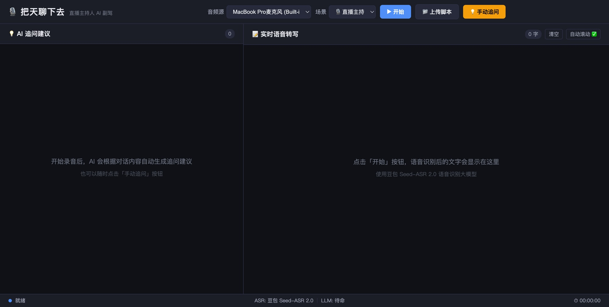

<div align="center">

# 🎙️ 把天聊下去

**你的 AI 对话副驾驶**

实时听你说话，帮你想下一句该聊什么。

[](https://nodejs.org/)
[](LICENSE)

</div>

---

你有没有过这样的时刻——直播时嘉宾话音刚落，脑子突然一片空白；采访做到一半，不知道下一个问题该往哪里引；面试官问完一轮，候选人的回答里明明有值得追的点，但就是反应不过来？

**「把天聊下去」** 就是为这些时刻而生的。它实时监听对话内容，用 AI 帮你生成高质量的追问建议——你只需要瞄一眼屏幕，就知道下一句该聊什么。

不是帮你写稿，不是帮你回答，而是帮你 **把天聊下去**。



## ✨ 核心功能

| 功能 | 说明 |
|------|------|
| 🗣️ **实时语音转写** | 基于豆包 Seed-ASR 2.0 大模型，高精度中文语音实时转文字 |
| 💡 **AI 智能追问** | 检测到说话停顿后自动生成 2-3 条追问建议，也支持手动触发（`Cmd+Enter`） |
| 🎭 **5 种场景模式** | 直播主持 / 访谈采访 / 招聘面试 / 口播录制 / 培训教学，各有专属 Prompt |
| ⚙️ **自定义指令** | 场景模式不够用？直接写你自己的 Prompt |
| 📁 **脚本上传** | 上传节目脚本或嘉宾资料（.txt / .md），AI 会结合内容给出更贴合的追问 |
| 🌙 **深色大字界面** | 直播环境不刺眼，大字号远距离也能看清 |

## 🎯 适用场景

### 🎙️ 直播 / 播客主持
嘉宾说完一段话，屏幕上立刻出现追问建议。你不再需要低头翻提纲，对话自然地往下走。

### 🎤 访谈 / 采访
记者、内容创作者的深度访谈助手。AI 从受访者的回答中捕捉值得深挖的细节，帮你追出好故事。

### 👔 招聘面试
候选人回答完，AI 用 STAR 法则帮你找到模糊的部分——哪里该追数据、哪里该追细节，面试效率翻倍。

### 📹 口播录制
一个人对着镜头讲，AI 充当你的编导——提示你补充案例、加个类比、转到下一个要点。

### 📚 培训 / 教学
讲师讲完一段知识点，AI 从学员视角生成可能的提问——哪里没讲清楚、哪里需要举例、哪里值得延伸。

## 🚀 快速开始

### 前提条件

- **Node.js v18+**（[下载](https://nodejs.org/) 或 `brew install node`）
- **Chrome 浏览器**（麦克风兼容性最好）
- **OpenRouter API Key**（[获取](https://openrouter.ai/keys)）— 用于 AI 追问生成
- **火山引擎凭证**（[获取](https://console.volcengine.com/speech/app)）— 用于语音识别

### 三步启动

```bash
# 1. 克隆并安装
git clone https://github.com/jianlongqiao-commits/chat-copilot.git
cd chat-copilot
npm install

# 2. 配置 API 密钥
cp .env.example .env
# 编辑 .env，填入你的 Key（见下方「配置说明」）

# 3. 启动
npm start
```

打开浏览器访问 **http://localhost:3000** ，点击「开始」，开聊。

> 📖 更详细的安装步骤（含 API 申请教程）请参考 [同事安装指南.md](同事安装指南.md)

## 🏗️ 技术架构

```
┌─────────────┐     WebSocket      ┌──────────────┐     WebSocket     ┌──────────────────┐
│  浏览器前端   │ ◄──────────────► │  Node.js 后端  │ ◄──────────────► │  豆包 Seed-ASR 2.0 │
│  (录音+显示)  │    PCM 音频流      │  (Express)    │   二进制协议       │  (语音识别)         │
└─────────────┘                    └──────┬───────┘                    └──────────────────┘
                                          │ HTTP POST
                                          ▼
                                   ┌──────────────┐
                                   │  OpenRouter   │
                                   │  (LLM API)   │
                                   └──────────────┘
```

- **前端**：原生 HTML/CSS/JS，AudioWorklet 采集 16kHz PCM 音频流
- **后端**：Node.js + Express + WebSocket，负责 ASR 协议转换和 LLM 调用
- **语音识别**：火山引擎豆包 Seed-ASR 2.0 大模型，服务端实时转写
- **AI 追问**：OpenRouter（兼容任何 OpenAI 格式 API），默认使用 DeepSeek

## ⚙️ 配置说明

编辑项目根目录的 `.env` 文件：

```bash
# ── LLM 配置（必填）──────────────────────
LLM_API_KEY=sk-your-api-key-here          # OpenRouter API Key
LLM_ENDPOINT=https://openrouter.ai/api/v1/chat/completions  # API 地址
LLM_MODEL=deepseek/deepseek-chat          # 模型选择

# ── 火山引擎 ASR 配置（必填）──────────────
ASR_APP_ID=your-app-id-here               # 火山引擎 APP ID
ASR_ACCESS_TOKEN=your-access-token-here   # 火山引擎 Access Token

# ── 追问触发参数（可选，一般不用改）────────
SILENCE_THRESHOLD=2000    # 停顿多久触发追问（毫秒）
MIN_INTERVAL=20000        # 两次追问最小间隔（毫秒）
MIN_TEXT_LENGTH=50        # 触发追问的最小新增文本量（字）
```

**LLM 模型推荐**：

| 模型 | 特点 |
|------|------|
| `deepseek/deepseek-chat` | 便宜、中文好、推荐默认使用 |
| `openai/gpt-4o-mini` | 快速、质量高 |
| `openai/gpt-4o` | 最高质量，价格较高 |

> 💡 LLM 接口兼容任何 OpenAI 格式的 API。除了 OpenRouter，你还可以使用：
> - **302.AI** — 国内中转站，支持主流模型，访问稳定
> - **硅基流动（SiliconFlow）** — 国产模型聚合平台
> - **OpenAI 官方** / **Azure OpenAI** — 直连
> - 任何兼容 OpenAI Chat Completions 格式的服务
>
> 只需修改 `.env` 中的 `LLM_ENDPOINT` 和 `LLM_API_KEY` 即可切换。

## 🎭 场景模式说明

| 模式 | 适用场景 | Prompt 策略 |
|------|---------|------------|
| 🎙️ 直播主持 | 直播、播客 | 观众视角追问，衔接上下文，不打断好话题 |
| 🎤 访谈采访 | 记者、内容创作 | 追细节、追故事，避免封闭式问题 |
| 👔 招聘面试 | HR、面试官 | STAR 法则追问，追数据和量化结果 |
| 📹 口播录制 | 自媒体录制 | 引导展开论述，补充案例和类比 |
| 📚 培训教学 | 讲师、培训 | 模拟学员视角，追问不清楚的概念 |
| ⚙️ 自定义 | 任意场景 | 你写什么 Prompt 就用什么 |

## ❓ 常见问题

**Q：一直显示"连接中"，卡住不动？**
> 检查 `.env` 里的 ASR 密钥是否正确。确认火山引擎后台已开通「流式语音识别模型2.0」并完成实名认证。

**Q：LLM 报错 403？**
> OpenRouter 上部分模型有地区限制。建议使用 `deepseek/deepseek-chat`，没有这个问题。

**Q：没有声音 / 不转写？**
> 检查 Chrome 是否授权了麦克风权限（地址栏左边的锁图标 → 网站设置 → 麦克风 → 允许）。

**Q：追问建议质量不够好？**
> 尝试切换场景模式，或使用「自定义」模式编写更具针对性的 Prompt。也可以上传脚本/资料让 AI 有更多上下文。

**Q：可以用其他语音识别服务吗？**
> 目前仅支持火山引擎豆包 Seed-ASR。如果你想接入其他 ASR，需要修改 `server.js` 中的 WebSocket 协议部分。

## 🤝 贡献

欢迎提交 Issue 和 Pull Request！

无论是 bug 修复、新场景模式、UI 改进，还是接入新的 ASR 服务——所有贡献都欢迎。

```bash
# Fork → Clone → Branch → Code → PR
git checkout -b feature/your-feature
```

## 📄 License

[MIT](LICENSE) — 自由使用，自由修改。

---

<div align="center">

# Chat Copilot — AI-Powered Conversation Assistant

**Real-time speech recognition + AI-generated follow-up questions to keep any conversation going.**

</div>

## What is this?

**Chat Copilot** (把天聊下去) is an open-source AI conversation co-pilot. It listens to your conversation in real time, transcribes speech to text, and automatically generates smart follow-up questions — so you always know what to ask next.

Whether you're hosting a live stream, conducting an interview, running a job interview, recording a video, or teaching a class, Chat Copilot acts as your invisible assistant that keeps the dialogue flowing.

## Features

- 🗣️ **Real-time Speech-to-Text** — Powered by ByteDance's Seed-ASR 2.0 (Chinese language)
- 💡 **AI Follow-up Suggestions** — Auto-triggered on speech pauses, or manually via `Cmd+Enter`
- 🎭 **5 Scene Modes** — Live hosting, interviews, recruitment, video recording, and training — each with tailored prompts
- ⚙️ **Custom Prompts** — Write your own system prompt for any scenario
- 📁 **Script Upload** — Upload show notes or guest bios for context-aware suggestions
- 🌙 **Dark, Large-Font UI** — Designed for glancing at during live sessions

## Quick Start

```bash
git clone https://github.com/jianlongqiao-commits/chat-copilot.git
cd chat-copilot
npm install
cp .env.example .env
# Edit .env with your API keys
npm start
```

Open **http://localhost:3000** in Chrome.

### Requirements

- Node.js 18+
- [OpenRouter](https://openrouter.ai/keys) API Key (for LLM)
- [Volcengine](https://console.volcengine.com/speech/app) credentials (for ASR — Chinese speech recognition)

> **Note:** The ASR component currently supports Chinese (Mandarin) only. The LLM can generate suggestions in any language if you customize the prompt.

## Scene Modes

| Mode | Use Case | Strategy |
|------|----------|----------|
| 🎙️ Live Host | Streams, podcasts | Audience-perspective questions, context-aware |
| 🎤 Interview | Journalism, content creation | Dig for details and stories, open-ended questions |
| 👔 Recruitment | HR, hiring managers | STAR method follow-ups, quantified results |
| 📹 Recording | Solo video content | Expand arguments, add examples and analogies |
| 📚 Training | Teachers, trainers | Simulate student questions, clarify concepts |
| ⚙️ Custom | Anything | Your prompt, your rules |

## Tech Stack

- **Frontend**: Vanilla HTML/CSS/JS, AudioWorklet for 16kHz PCM capture
- **Backend**: Node.js + Express + WebSocket
- **ASR**: ByteDance Seed-ASR 2.0 (via Volcengine)
- **LLM**: OpenRouter (compatible with any OpenAI-format API)

## License

[MIT](LICENSE)
